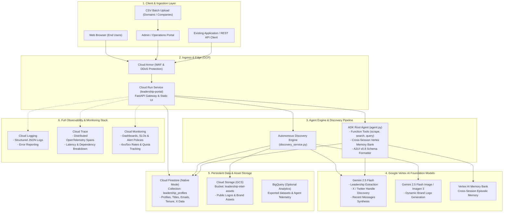

# Architecture & Code Components Specification

## 1. Executive Summary & System Overview

The **Leadership & Board Intelligence Platform** is an enterprise-grade agentic application deployed on **Google Cloud Platform (GCP)**. It provides autonomous executive and board discovery, company branding synthesis, leadership social presence tracking (X/Twitter handles and latest messages), cross-session memory, A2UI visual cards, and multi-tenant batch ingestion and analytics exports.

### High-Level Architecture Diagram



---

## 2. Core Code Components

| Component File | Role / Responsibility | Key Interfaces & Dependencies |
| :--- | :--- | :--- |
| [`frontend/main.py`](frontend/main.py) | **API Gateway & Web Server**:<br>Exposes REST endpoints for search, batch ingestion, CSV/JSON exports, and serves front-end static files. | FastAPI, CORS Middleware, Google Cloud Firestore SDK. |
| [`frontend/discovery_service.py`](frontend/discovery_service.py) | **Autonomous Research Pipeline**:<br>1. Web scraping & HTML DOM traversal.<br>2. Wikipedia & external context lookups.<br>3. Gemini 2.5 Flash structured extraction for C-suite, Board, corporate emails, and X/Twitter handles.<br>4. Vertex AI Imagen/Flash-Image logo synthesis.<br>5. Cloud Storage upload & Firestore persistence. | `google-genai` (Vertex AI), `google-cloud-storage`, `google-cloud-firestore`, `httpx`, `BeautifulSoup4`. |
| [`app/agent.py`](app/agent.py) | **Agent Core (ADK)**:<br>Defines the conversational reasoning engine, function tools (`search_leadership_intel`, `scrape_company_site`, `add_leadership_profile`), vertex memory bank preloading, and A2UI callbacks. | `google.adk`, `A2uiSchemaManager`, `BasicCatalog`. |
| [`app/a2ui_utils.py`](app/a2ui_utils.py) | **A2UI Formatter**:<br>Post-model callback interceptor transforming structured JSON agent responses into rich UI card schemas for the client. | `a2ui.core`, `google.genai.types`. |
| [`frontend/static/index.html`](frontend/static/index.html) | **Search & Intelligence UI**:<br>Search interface with live suggestions, brand logo banner, C-suite grid, Board of Directors grid, verified email links, X handles, and 3 latest messages. | Responsive HTML5/CSS3, Material Symbols, Vanilla JavaScript. |
| [`frontend/static/admin.html`](frontend/static/admin.html) | **Admin Dashboard & Data Operations**:<br>Live data table across all profiles, Drag-and-drop batch CSV file ingestion, 1-click CSV & JSON full export buttons. | HTML5 File API, Streaming Fetch, Dynamic DOM rendering. |
| [`frontend/Dockerfile`](frontend/Dockerfile) | **Production Container Specification**:<br>Lightweight Python 3.12 slim image containerizing the FastAPI service. | Docker, Gunicorn/Uvicorn worker process model. |

---

## 3. Data Schema Specifications

### Cloud Firestore: Collection `leadership_profiles`

Each profile document is keyed by `{company-slug}-{member-slug}` (e.g. `alphabet-inc-sundar-pichai`):

```json
{
  "id": "string (unique document ID)",
  "company_name": "string (e.g. 'Alphabet Inc.')",
  "company_url": "string (e.g. 'https://abc.xyz')",
  "company_twitter_handle": "string (e.g. '@Alphabet')",
  "company_recent_tweets": [
    "string (latest tweet 1)",
    "string (latest tweet 2)",
    "string (latest tweet 3)"
  ],
  "name": "string (Full name)",
  "title": "string (e.g. 'Chief Executive Officer')",
  "group": "string ('Executive Management' | 'Board of Directors')",
  "email": "string (e.g. 'sundar@google.com' or 'N/A')",
  "twitter_handle": "string (e.g. '@sundarpichai' or 'N/A')",
  "recent_tweets": [
    "string (recent statement/tweet 1)",
    "string (recent statement/tweet 2)",
    "string (recent statement/tweet 3)"
  ],
  "logo_url": "string (GCS public URL: https://storage.googleapis.com/...)",
  "committee": "string | null (e.g. 'Audit Committee')",
  "is_independent": "boolean (true for non-executive board members)",
  "tenure_years": "integer | null",
  "bio": "string (1-2 sentence executive background)",
  "source_url": "string (source URL of verified data)",
  "updated_at": "timestamp"
}
```

---

## 4. Endpoints & Integration Interface

When integrating this service into an existing application (e.g., Salesforce, HubSpot, internal CRM, or another frontend):

### 1. `GET /api/search?q={query}`
- **Query Parameter**: `q` (Company name, domain, or executive name).
- **Behavior**: Checks Firestore first. If zero records exist, automatically runs the real-time discovery engine, generates the logo, extracts X handles & messages, persists everything, and returns the response.
- **Response**: JSON payload with `executives`, `board_of_directors`, `company_logo`, `company_twitter_handle`, and `company_recent_tweets`.

### 2. `POST /api/admin/upload-batch`
- **Body**: `multipart/form-data` with `file: <file.csv>`.
- **CSV Format**: A CSV file with column `domain` or `company_name` (one row per target).
- **Behavior**: Skips already indexed companies, scrapes and enriches all new entries concurrently, saves to DB.

### 3. `GET /api/admin/export/csv`
- **Output**: Content-Type `text/csv` with `Content-Disposition: attachment; filename=all-leadership-intel-data.csv`.
- **Fields**: Company, Company Twitter, Name, Title, Group, Email, Individual Twitter, Recent Tweets, Logo URL, Committee, Independent, Tenure, Company URL, Bio.

### 4. `GET /api/admin/export/json`
- **Output**: Formatted JSON array containing the entire database catalog.

---

## 5. Deployment Guide (GCP Cloud Run)

### Prerequisites
1. GCP Project with Billing Enabled.
2. Google Cloud SDK (`gcloud`) installed and authenticated.
3. Enabled APIs:
   ```bash
   gcloud services enable \
     run.googleapis.com \
     firestore.googleapis.com \
     storage.googleapis.com \
     aiplatform.googleapis.com \
     cloudtrace.googleapis.com \
     logging.googleapis.com \
     monitoring.googleapis.com
   ```

### Step 1: Create GCS Public Bucket for Logos
```bash
export PROJECT_ID=$(gcloud config get-value project)
export BUCKET_NAME="leadership-intel-assets-${PROJECT_ID: -4}"

gcloud storage buckets create gs://${BUCKET_NAME} \
  --location=us-east1 \
  --uniform-bucket-level-access

# Allow public read for logos
gcloud storage buckets add-iam-policy-binding gs://${BUCKET_NAME} \
  --member=allUsers \
  --role=roles/storage.objectViewer
```

### Step 2: Provision Cloud Firestore
```bash
gcloud firestore databases create \
  --location=us-east1 \
  --type=firestore-native
```

### Step 3: Deploy to Cloud Run
From the root of `leadership-intel-agent/frontend`:
```bash
gcloud run deploy leadership-portal \
  --source . \
  --region us-east1 \
  --allow-unauthenticated \
  --set-env-vars "GOOGLE_CLOUD_PROJECT=${PROJECT_ID},GOOGLE_GENAI_USE_VERTEXAI=true,GOOGLE_CLOUD_LOCATION=us-central1" \
  --memory 1Gi \
  --cpu 1 \
  --min-instances 0 \
  --max-instances 10
```

---

## 6. Enterprise Observability & Monitoring Setup

To ensure enterprise-grade reliability, latency visibility, and proactive alerting on GCP:

### A. Distributed Tracing (Cloud Trace & OpenTelemetry)
- **Automatic Trace Propagation**: OpenTelemetry spans are attached to incoming HTTP requests, Vertex AI model requests (`gemini-2.5-flash`), image generation calls (`gemini-2.5-flash-image`), and Firestore read/write operations.
- **Trace Explorer**: View latency breakdowns, cold starts, and downstream bottlenecks in **GCP Console → Cloud Trace → Trace Explorer**.

### B. Structured Logging (Cloud Logging)
- All errors, scrapings, batch jobs, and token usage metrics are exported in structured JSON format:
  ```json
  {
    "severity": "INFO",
    "message": "Discovered and saved new company",
    "company": "Spotify",
    "profiles_count": 8,
    "latency_ms": 3420,
    "trace": "projects/PROJECT_ID/traces/TRACE_ID"
  }
  ```
- **Error Reporting**: Uncaught exceptions are automatically grouped and alerted via **Google Cloud Error Reporting**.

### C. Metrics, SLOs & Alerting (Cloud Monitoring)
Set up automated alerting policies for operational health:

1. **Service Availability SLO (Alert on 5xx Error Rate > 1%)**:
   ```bash
   gcloud alpha monitoring policies create --policy='{
     "displayName": "Leadership Portal - High 5xx Error Rate",
     "combiner": "OR",
     "conditions": [{
       "displayName": "Cloud Run 5xx rate > 1%",
       "conditionThreshold": {
         "filter": "resource.type = \"cloud_run_revision\" AND metric.type = \"run.googleapis.com/request_count\" AND metric.labels.response_code_class = \"5xx\"",
         "aggregations": [{"alignmentPeriod": "60s", "perSeriesAligner": "ALIGN_RATE"}],
         "comparison": "COMPARISON_GT",
         "thresholdValue": 0.01,
         "duration": "120s"
       }
     }]
   }'
   ```

2. **Latency SLO (Alert on p95 Request Latency > 8s)**:
   Triggered if scraping or LLM extraction exceeds normal thresholds, notifying engineering on-call channels (Slack, PagerDuty, or Email).

3. **Vertex AI Quota Monitoring**:
   Dashboard tracking `aiplatform.googleapis.com` request count against per-minute quota limits to prevent throttling during heavy batch uploads.
